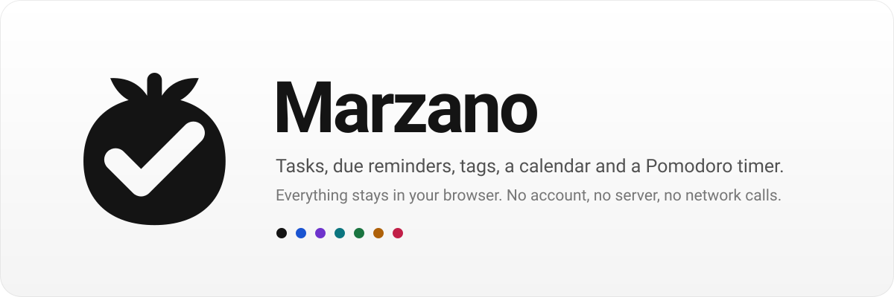

<p align="center">
  <picture>
    <source media="(prefers-color-scheme: dark)" srcset=".github/assets/banner-dark.svg">
    
  </picture>
</p>

<p align="center">
  <a href="https://marzano.bobbyhuang.dev"><strong>Open the app</strong></a>
  &nbsp;·&nbsp; <a href="#features">Features</a>
  &nbsp;·&nbsp; <a href="#getting-started">Getting started</a>
  &nbsp;·&nbsp; <a href="#your-data">Your data</a>
  &nbsp;·&nbsp; <a href="CONTRIBUTING.md">Contributing</a>
</p>

<p align="center">
  <a href="https://github.com/bobbyhuang-dev/marzano/actions/workflows/deploy.yml"></a>
  <a href="LICENSE"></a>
  <a href=".nvmrc"></a>
</p>

Marzano is a focused task list with due reminders, tags, a calendar, and a built-in Pomodoro timer. It runs entirely in the browser and keeps everything on your device: no account, no server, no network calls. It is a San Marzano tomato wearing a check, which is the whole pun.

## Features

**Tasks** — Add a task with an optional due date and tags, edit or delete it inline, and check it off. Completing a task raises a toast with an Undo action. Drag a row by its grip, or move it with the arrow keys, to set the order by hand.

**Descriptions and subtasks** — Add Markdown notes and a single-level checklist in the task editor. Each subtask has its own name and completion state. Expand a task to read its notes and check off steps; the progress count updates immediately. Editor changes are saved together, and Cancel discards the draft. Parent and child completion are independent: completing or restoring a task preserves its checklist, which remains readable in Completed.

**Due dates and reminders** — Type the date into the name and it is read as you go: "Call mum tmr", "Pay rent by friday", "Dentist sep 12 at 3pm", "Renew in 2 weeks", "Rent on the 1st". The words are boxed in the field, come out of the saved name, and deleting them removes the date again; picking a date from the button instead keeps them as plain words. A due date is either a day (`Fri, Mar 14`) or a day and a time; day-only tasks come due at the end of that day. The date is coloured by how near it is: red once it has passed, green today, amber tomorrow, purple within the week, and grey beyond that. When a task falls due the app raises a reminder, including in a tab left open or in the background. The picker has Tomorrow and Next week shortcuts and an optional time.

**Calendar** — Open tasks laid out on the days they are due, a week or a month at a time. Pick a day to see its tasks in a list where they can be completed, edited, and deleted as on the task page, or add a task straight onto that day. The grid is one tab stop: arrow keys, Home/End and PageUp/PageDown move through it.

**Sorting and filtering** — Order open tasks by deadline in either direction, with undated tasks at the bottom, or keep your manual order. Filter the list to one or more tags. The sort is remembered between sessions; the filter is not.

**Tags** — Colour-coded labels from a 30-colour spectrum. Each new tag is offered the first unused colour, and its text renders black or white against the fill, whichever is more readable. The Tags page shows how much open and total work sits behind each tag, and every tag has its own page listing its tasks.

**Pomodoro** — A focus timer wired into the list: pick a task, run a round, and the time is credited to that task. Focus, short-break and long-break lengths, the long-break interval, and auto-start are all configurable. A finished round is announced with a chime, an in-app toast, and, with permission, a desktop notification. An activity panel shows today's focus time, rounds, tasks touched, and recent sessions. The timer is reconstructed from wall-clock time, so a reload, a backgrounded tab, or a sleeping machine cannot lose a round.

**Completed archive** — Checked-off tasks stay under Completed for 30 days, where they can be restored or deleted, and are then removed automatically. Tasks close to the cutoff are called out.

**Local data** — Choose a folder in desktop Chrome or Edge. Tasks, tags and Pomodoro settings/history autosave to `marzano.json` while the app is open, with a visible save status and up to 24 hourly recovery copies in `marzano-recovery/`. Existing browser data carries over when choosing a new folder. Opening an existing folder previews its data before use or merge; old version 1 and 2 backup files can be opened through Local data too.

Descriptions and subtasks travel with their parent task and merge as one record; simultaneous edits to different subtasks are not combined. A merge keeps the current manual order and timer settings. Other browsers support opening a data file and saving a copy, but cannot autosave to an ordinary folder.

**Appearance** — Light and dark themes that follow the system by default, seven accent colours, and a display size that scales the whole app rather than just the text. All three are applied before the first paint, so there is no flash on load.

**Guided first run** — A browser opening Marzano for the first time gets a seven-step guide: what the app is, how your data stays on your device, and one card for each view. It can be skipped and is always available again from Guide in the sidebar.

**What's new** — The first visit after an update raises a short notice with a link to the changelog. The changelog is built from the commit history at build time, lists every change newest first, and marks the ones this browser has not seen. The notice can be switched off from the changelog or in Settings.

**Accessible and responsive** — Keyboard-navigable throughout, with every change announced to screen readers through a live region. The sidebar collapses to a sheet on small screens, and animation is dropped when the system asks for reduced motion.

## Getting started

Requires **Node 24 LTS** (pinned in `.nvmrc`; 20.19+ and 22.13+ also work) and [pnpm](https://pnpm.io), which `corepack enable` provides at the pinned version.

```bash
nvm use          # or: fnm use
pnpm install
pnpm dev
```

The dev server prints a local URL. The other scripts:

```bash
pnpm build     # type-check, then bundle to dist/client/
pnpm preview   # serve the production build locally
pnpm lint      # eslint .
pnpm icons     # re-render the favicon set in public/ from src/lib/brand.ts
```

`pnpm test:storage` runs focused persistence regression tests using Node 24. `pnpm build` type-checks the whole project; lint and build remain deployment gates. The output in `dist/client/` is a static site that any host can serve, with every path falling back to `index.html`.

## Deployment

Production is [marzano.bobbyhuang.dev](https://marzano.bobbyhuang.dev), served as static assets from Cloudflare Workers. Every push to `main` runs the [deploy workflow](.github/workflows/deploy.yml), which lints, builds, and publishes; a merged change is live within minutes. The workflow needs the repository secrets `CLOUDFLARE_API_TOKEN` and `CLOUDFLARE_ACCOUNT_ID`, and it checks out the full history because the changelog is built from the git log.

Deployments never touch user data. When moving between hostnames, wait for “Saved to folder” on the old site, then choose the same folder on the new site. Folder permissions are specific to the browser and site.

## Your data

Tasks, tags, and Pomodoro settings/history live in the folder you select. `marzano.json` is a versioned, readable JSON file. Writes are serialized, checked against the last file read, committed by closing a writable stream, and read back before reporting success. An external file change pauses saving for review; a missing or invalid live file is never silently overwritten. Use one browser at a time for the same folder; this is local storage, not cross-device sync. A second editing tab in the same browser is blocked to protect pending changes.

**Saved files survive clearing cookies and site data.** Browser cleanup can remove the remembered folder permission and recovery cache. Choose the same folder again, review its contents, and select **Use this file**. Wait for **Saved to folder** before cleanup: edits that have only reached browser storage are not protected. Choose a folder outside iCloud/Dropbox if you want the files to remain exclusively on your laptop.

IndexedDB holds the remembered directory handle and a recovery copy of pending changes. An atomic localStorage recovery snapshot also preserves edits when IndexedDB is unavailable; the newer valid snapshot is used on reload. Without a connected folder, data is only in this browser and remains vulnerable to site-data cleanup. A failed save or lost permission is displayed; changes stay pending for retry. **Open a file** reads recovery snapshots and old backups; **Save a copy** downloads the current data.

Theme, accent, display size, sort, calendar scope, sidebar, guide/update flags and the running Pomodoro timer remain browser preferences in `localStorage`. Clearing browser data resets them. The app reads legacy task/tag/history storage when no recovery snapshot exists and retains those original keys without overwriting or deleting them. No task data is uploaded by Marzano. Folder access requires HTTPS or localhost, a supported browser, and permission granted through a user-initiated picker.

Existing users see a one-time **Save your tasks to a folder** notice. **Not now** keeps the app usable; the **In this browser only** status above each page stays until folder setup succeeds. Unsupported browsers are offered **Save a copy** to carry the data to Chrome or Edge. A transfer is marked complete only after a verified folder save or review of an existing matching file. A failed or canceled setup does not mark it complete.

If an older app tab remains open across deployment and changes the legacy data, the new app pauses folder writes and offers **Review changes**. Close the older tab, review the data, and merge or explicitly replace it; both copies remain available until that decision. The deployment workflow runs the storage/upgrade regression tests before publishing.

## Built with

React 19, TypeScript, and Vite. Styling is Tailwind CSS v4 with [shadcn/ui](https://ui.shadcn.com) components on Radix primitives. Icons are [Lucide](https://lucide.dev), toasts are [Sonner](https://sonner.emilkowal.ski), animation is [Motion](https://motion.dev), date handling is [date-fns](https://date-fns.org), and the date picker is [React DayPicker](https://daypicker.dev).

## Project layout

```
src/
  App.tsx          application state and view switching
  components/      feature components
  components/ui/   shadcn/ui primitives
  hooks/           due reminders, completed-task cleanup, Pomodoro controller, theme, updates
  lib/             tasks, tags, calendar, Pomodoro, backup, sync, and their persistence
  index.css        Tailwind theme, colour tokens, and motion
scripts/
  git-releases.ts  Vite plugin that turns the git log into the changelog
  render-icons.mjs renders public/ from the brand mark
```

[`CLAUDE.md`](CLAUDE.md) documents the architecture in depth: the persistence contract, the due-date encoding, the sync bookkeeping behind Local data, and how the Pomodoro state machine works.

## Contributing

Issues and pull requests are welcome. [CONTRIBUTING.md](CONTRIBUTING.md) covers the setup, the checks to run, and why commit messages double as release notes. Security problems go through [SECURITY.md](SECURITY.md) rather than a public issue.

## License

[MIT](LICENSE) © 2026 Bobby Huang

The Pomodoro alert sounds are Google's [Material Design product sounds](https://material.io/design/sound/sound-resources.html), used under [CC BY 4.0](https://creativecommons.org/licenses/by/4.0/); see [src/assets/sounds/LICENSE.md](src/assets/sounds/LICENSE.md).
